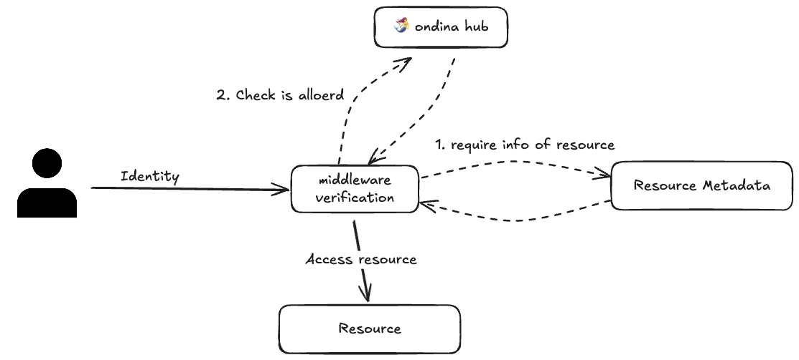
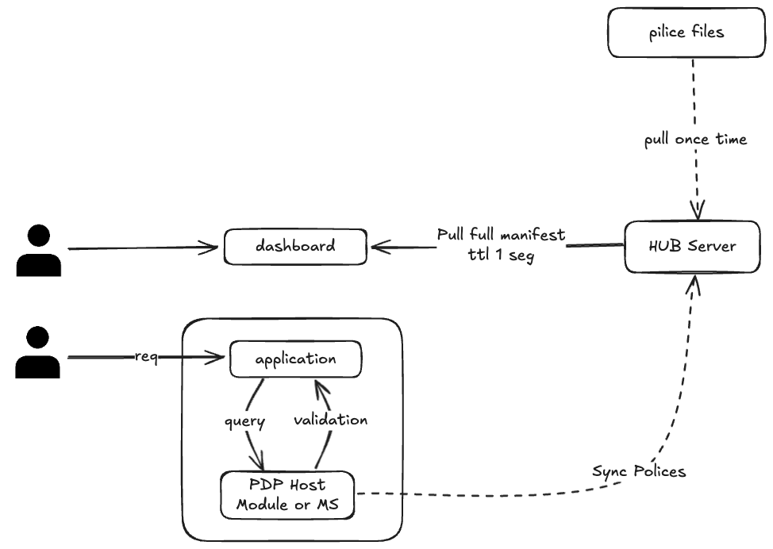

# Ondina

Fine-grained access control. We are the AM on IAM.

## How to work ondina





## Create a stateless HUB

Import the `@ondina/hub`

**Sample:**

```ts
import { Hub } from "@jondotsoy/ondina-hub/hub";
import type { HubManifest } from "@jondotsoy/ondina-hub/hub-manifest";

const manifest: HubManifest = {
  permissions: ["users.list", "users.create", "users.delete"],
  roles: [
    { id: "rrhh", permissions: ["users.list", "users.create"] },
    {
      id: "admin",
      permissions: ["users.list", "users.create", "users.delete"],
    },
  ],
  users: [
    { id: "bob", roles: ["rrhh"] },
    {
      id: "alice",
      roles: [
        {
          role: "admin",
          condition: {
            equal: ["group.office", "NY"],
          },
        },
      ],
    },
  ],
};

const hub = await Hub.from(manifest);

await hub.isAllowed({
  principalId: "alice",
  resource: {
    group: {
      office: "NY",
    },
  },
  action: "users.delete",
}); // => true
```
