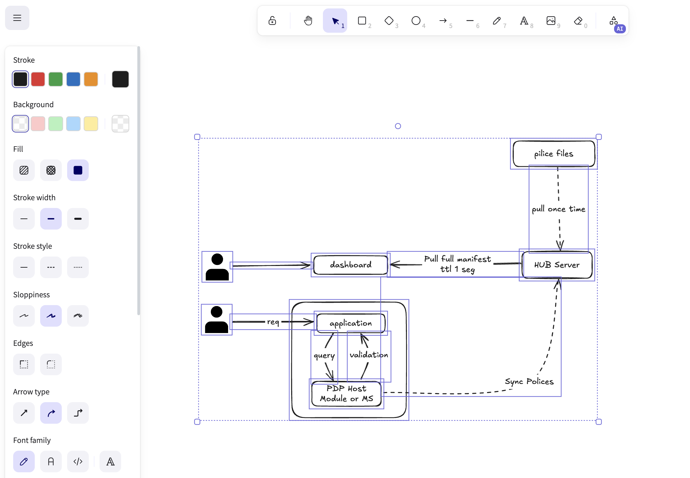
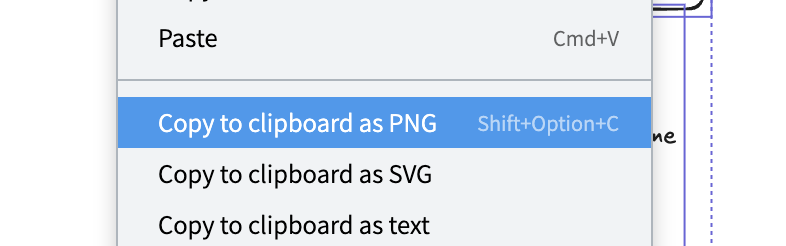

## Open Excalidraw files

1. Open the excalidraw file and copy the content in your clipboard.
2. Go to https://excalidraw.com/ and paste the clipboard.

## Save a Excalidraw file

1. On https://excalidraw.com/ select you draw and copy the selection.
   
2. Open a file with extension `.excalidraw` and paste here the clipboard.
3. On https://excalidraw.com/ select you draw and copy the selection as PNG.
   
4. Paste the clipboard just below the excalidraw file and rename the file with same name.
